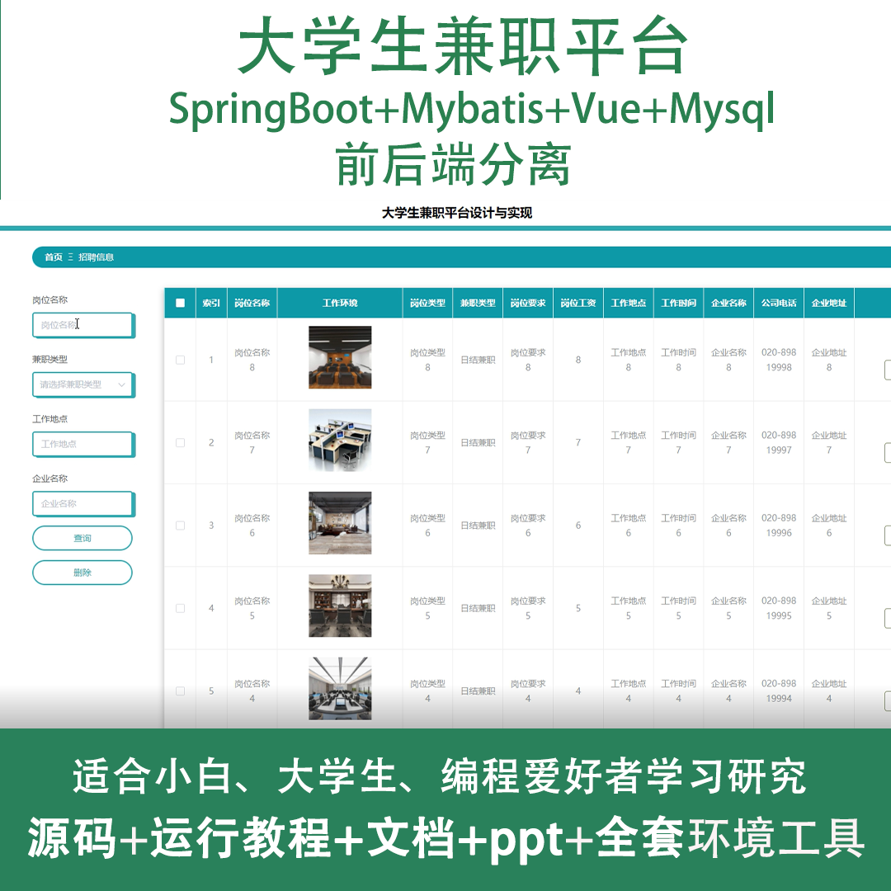
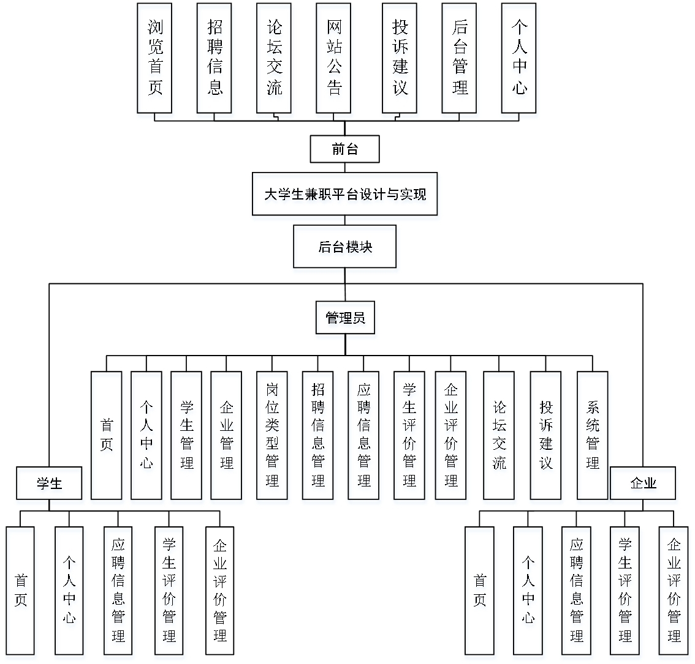
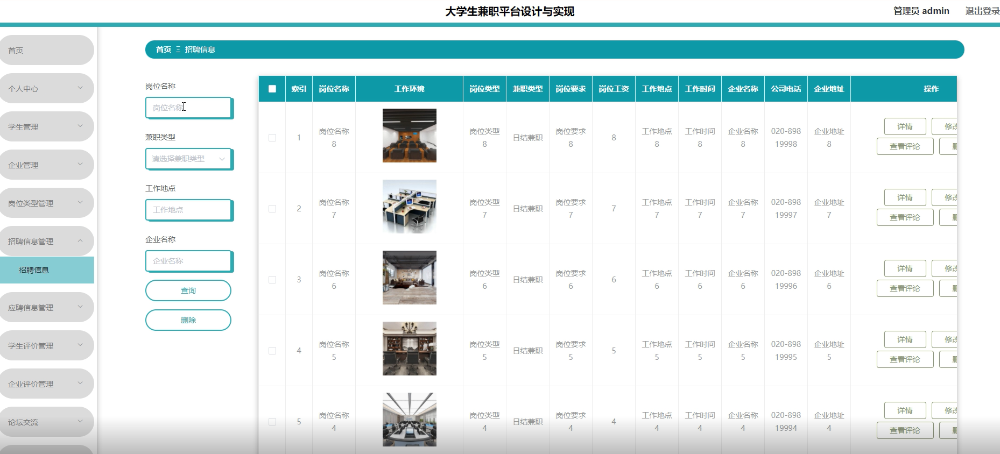
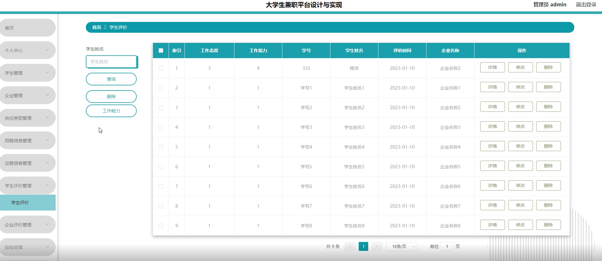
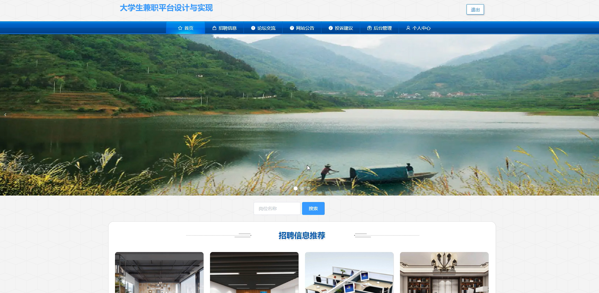
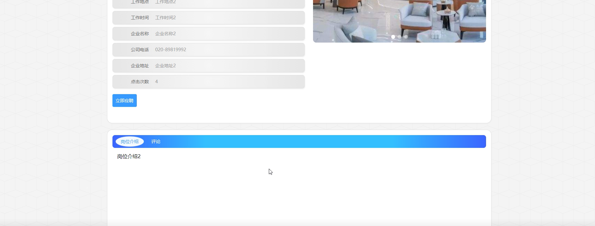
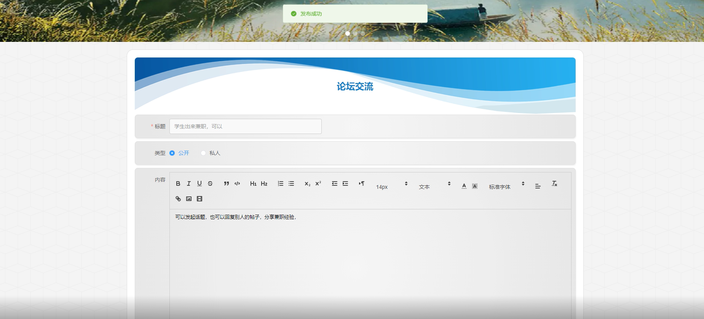
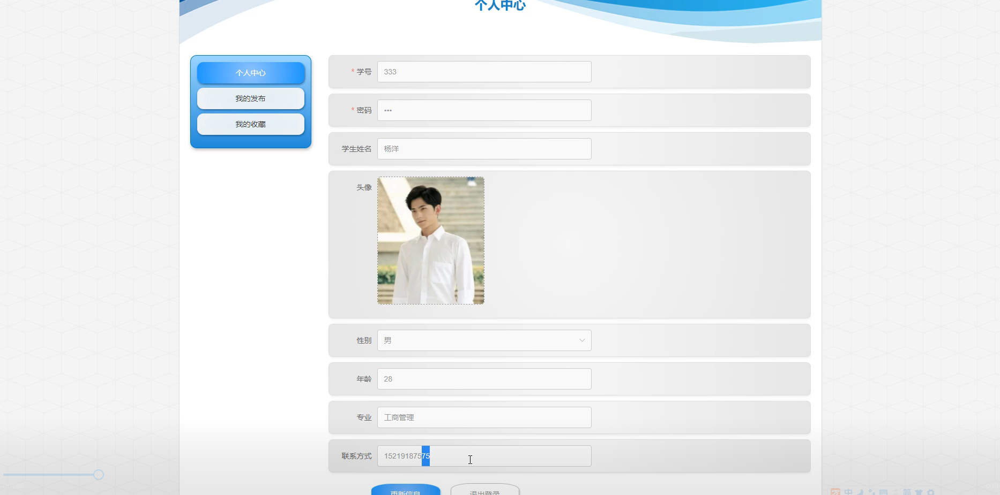
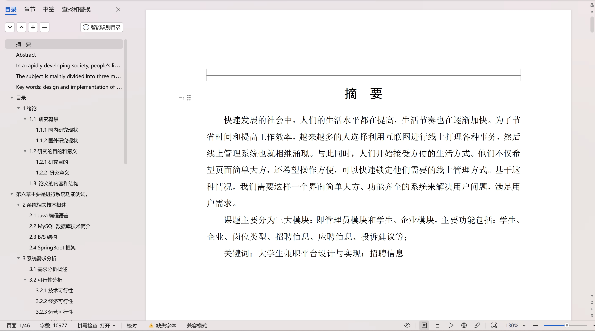

 
## 查看主页获取源码

> **作者介绍**： **✌**全网粉丝10W+本平台特邀作者、博客专家、CSDN新星计划导师、java领域优质创作者,博客之星、掘金/华为云/阿里云/InfoQ等平台优质作者、专注于项目实战 **✌**

  

### 一、作品包含

源码+数据库+设计文档万字+PPT+全套环境和工具资源+部署教程

### 二、项目技术

前端技术：Html、Css、Js、Vue、Element-ui

数据库：MySQL

后端技术：Java、Spring Boot、MyBatis

  

### 三、运行环境

开发工具：IDEA/eclipse

数据库：MySQL5.7

数据库管理工具：Navicat10以上版本

环境配置软件： JDK1.8+Maven3.6.3

前端Nodejs：14

### 四、项目介绍
项目编号：springbootA140

在高等教育普及化和就业市场竞争日益激烈的背景下，大学生兼职平台应运而生，该平台致力于为大学生们提供一个便捷、安全的兼职信息发布与求职环境，旨在帮助学生群体更好地利用课余时间参与社会实践，提升职业技能，同时缓解就业压力，为学生的成长和职业发展提供有力支持。

前台学生功能：浏览首页、招聘信息、论坛交流、网站公告、投诉建议、后台管理和个人中心。

后台分为管理员、学生、企业
管理员的功能：首页、个人中心、学生管理、企业管理、岗位类型管理、招聘信息管理、应聘信息管理、学生评价管理、企业评价管理、论坛交流、投诉建议和系统管理。
学生的功能：首页、个人中心、应聘信息管理、学生评价管理、企业评价管理。
企业的功能：首页、个人中心、应聘信息管理、学生评价管理、企业评价管理。

### 五、运行截图

  
